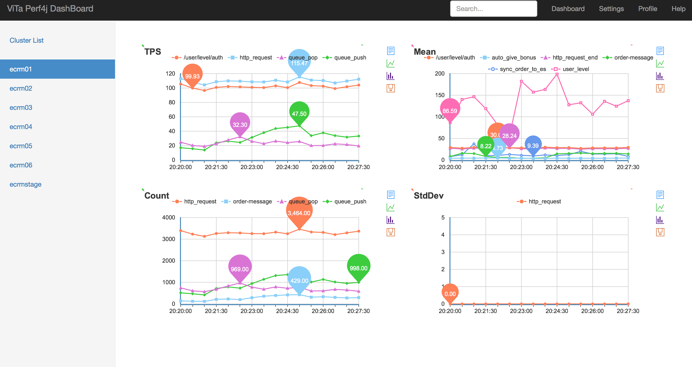

# perf4j

Performance Monitoring and Statistics for Java Code

## perf4j-zh与perf4j比较

1. 重写per4j的图表渲染，由google的chartApi改为baidu的Echart图表，更适合国内行情
1. 另外增加集群监控，监控图表渲染与监控项目独立

新的图表渲染样式如下

## 为什么开发perf4j-zh

google网站并不是每个人都可以访问，但自己又不想放弃perf4j这款轻量方便的组件，它可以和常用的日志系统如log4j，logback集成，所以为了继续使用它，图表渲染的功能
修改为baidu的Echart，更适合我们国内企业和开发人员的使用

另外，它的官网也不在对外开放，使用方式我会按照我目前知道的写个简单的介绍

## 快速上手

**1.本地构建**

首先你需要在本地将vita-perf4项目install到你本地，请执行下面脚本构建

    sh ./build.sh
    
**2.运行perf4j监控**
    
    cd perf4j-dashboard
    mvn jetty:run
    
启动完毕后访问：[127.0.0.1:8889](http://127.0.0.1:8889) ，你也可以更改端口号，通过修改 perf4j-dashboard/pom.xml下面的配置
    
    <properties>
        <jetty.stop.port>10000</jetty.stop.port>
        <jetty.run.port>8889</jetty.run.port>
    </properties>
    

**3.运行perf4j-demo演示项目**

此时，你没有监控到任何数据，因为还没有被监控的项目启动，perf4j-demo是一个用于演示的demo项目，它引入了vita-perf4j，通过同样方式启动
在这个演示项目中，它会使用perf4j监控接口访问TPS、响应时间和请求数
 
    cd perf4j-demo
    mvn jetty:run
    
启动成功后，需要不断访问演示项目，使其产生请求量
    
    sh ./test.sh

然后在观察访问perf4j-dashboard，查看监控图表 
   
   
## perf4j-dashboard
   
dashboard是一个对所有依赖perf4j的项目进行集群监控的项目，它由原perf4j图表监控只能在依赖项目中查看，改为dashboard去拉取集群中每个节点的监控数据统一在dashboard中渲染

### 使用方式

1. 在依赖项目中配置查看监控数据的servlet,在web.xml文件中加入下面配置

     <servlet>
         <servlet-name>perf4j</servlet-name>
         <servlet-class>org.perf4j.servlet.VitaGraphingServlet</servlet-class>
     </servlet>
     <servlet-mapping>
         <servlet-name>perf4j</servlet-name>
         <url-pattern>/admin</url-pattern>
     </servlet-mapping>
     
2. 在dashboard项目中配置集群中所有节点，在ServerCluster.conf 文件中像下面这样加入每一个服务的监控数据地址

    ServerCluster: {
    
      clusterList = [
        {
          name = perf4j-demo
          ip = 127.0.0.1
          port = 8888
          url = "/admin"
        }
    
        {
          name = perf4j-demo02
          ip = 127.0.0.1
          port = 8888
          url = "/admin"
        }
    
        {
          name = perf4j-demo03
          ip = 127.0.0.1
          port = 8888
          url = "/admin"
        }
      ]
    
    }
     
这样，dashboard项目通过配置的集群中的节点的ip、port和servlet的访问地址去拉取性能数据，然后渲染上文中介绍的图表样式     

## vita-perf4j

vita-perf4j其实就是官网的源码，只是修改了它的图表渲染，加入显示性能数据的servlet，在使用这个项目时就和使用perf4j没有区别，不做太多介绍了

## perf4j-demo

这是一个依赖vita-perf4j的Demo项目,在`PerformanceInterceptor`和`TestController`了有使用的列子

## perf4j  解读

1. 数据收集与统计分析
    1. [数据收集](./doc/StopWatch.md)
    1. [数据统计](./doc/TimingStatistics.md)
    1. [对数据数据统计进行分组，格式化输出方式:GroupedTimingStatistics](./doc/GroupedTimingStatistics.md)
1. 日志系统对接
    1. [stop、lap方法调用时日志收集](./doc/LoggingStopWatch.md)
    1. [log4j、logback、slf等日志组件对接方式](./doc/Log4jStopWatch.md)
1. 图表渲染
    1. [性能图表渲染](./doc/graph.md)
    1. [原google图表渲染](./doc/GoogleChart.md)
    1. [新baidu Echart图表渲染](./doc/Echart.md)
    1. [集群监控](./doc/dashboard.md)
    
    
   
   
